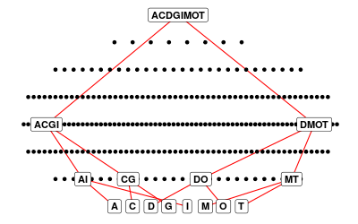

# Chemical Pollutants vs Bacterial Communities
Investigating the effects of chemical mixtures on microbial community structure and function.

This is a follow-on from our Nature Microbiology paper [*High-througput characterization of bacterial responses to complex mixtures of chemical pollutants*](https://doi.org/10.1038/s41564-024-01626-9), where we assayed the responses of single strains of bacteria to chemical mixtures. Here we have assayed the responses of whole microbial communities to all mixtures of the same 8 chemicals used previously:

| Chemical      | Environment | Target  |
| ----------- | ----------- | --------- |
| Amoxicillin | Urban | Antibiotic |
| Chlorothalonil | Rural | Fungicide |
| Diflufenican | Rural | Herbicide |
| Glyphosate | Urban | Herbicide |
| Imidacloprid | Urban | Insecticide/Nematicide |
| Metaldehyde | Rural | Insecticide/Molluscicide |
| Oxytetracycline | Rural | Antibiotic |
| Tebuconazole | Urban | Fungicide |


Communities were revived in 1/10 LB media and grown to carrying capacity. Cultures were diluted 1:100 from carrying capacity in 1/10 LB media supplemented with chemical stressor additions at 0.1mg/L. Absorbance at 600nm (OD600) was then recorded for 72hrs at 1hr interval timepoints to capture the entire growth curves for these bacterial communities. Each community-chemical treatment has 4 replicates.

To understand the impacts of the chemicals on community composition, a subset of the communities were sequenced at the end-point of the growth experiment. Not all community-checmical combination could be sequenced due to costs, so we performed a structured random sampling to determine what would be sequenced. For each community, we sequenced each of the single-chemical treatments and the 8-chemical treatment. We randomly chose 2-chemical and 4-chemical treatments to sequence for each community, but structured such that the 2-chemical treatments were subsets of the 4-chemical treatments and no single chemicals were duplicated within these treatments, e.g.:



If you imagine that each point is a chemical mixture and each row contains more chemicals, from 1 chemical at the bottom row, to all 8 in the top point, with the chemicals represented by a letter. We sequenced two of these sampled "pyramids" from each community, sequencing two biological replicates for each chemical mixture. This will allow us to investigate the effects of mixtures in comparison to the effects of subsets of those mixtures. Code for the structured sampling is in ```code/structured-sampling.R```.

# Repository contents

## Data

## Code

## Notebooks

qiime-workflow.md - workflow for ASV prediction from raw sequence data, and enzyme pathway prediction via picrust.